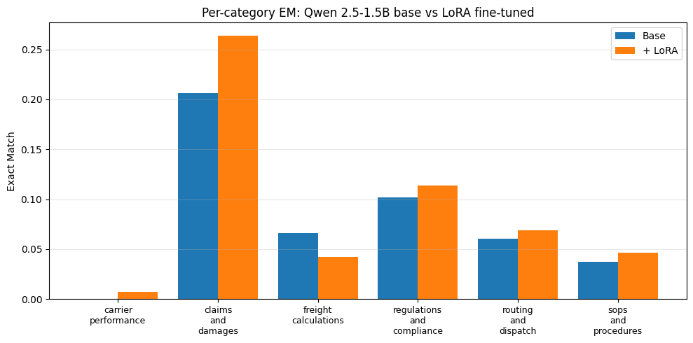

# Logistics QA — QLoRA fine-tuning of Qwen 2.5-1.5B-Instruct

QLoRA (4-bit NF4) fine-tuning of [Qwen 2.5-1.5B-Instruct](https://huggingface.co/Qwen/Qwen2.5-1.5B-Instruct) on a 5,400-example synthetic Q&A dataset covering logistics and supply-chain operations: freight calculations, carrier performance, claims, routing, SOPs, and FMCSA / customs compliance. Includes the dataset generator, training pipeline, evaluation harness, and a FastAPI streaming inference server.

```text
Question:  "What's the deadline for filing a concealed-damage freight claim under U.S. law?"
Answer:    "Under 49 CFR 370.3, the claim must be filed in writing with the carrier
            within 9 months of delivery. The carrier must acknowledge within 30 days
            and pay, decline, or make a firm offer within 120 days."
```

## Why this project

While doing logistics-ops analytics during a co-op term, I noticed a recurring pattern: the same regulatory and procedural questions came up over and over — "what's a Carmack-Amendment claim limit?", "what's the DIM factor for LTL?", "what's the difference between C-TPAT and AEO?". Generic LLMs answer these inconsistently because the underlying facts are scattered across CFR text, NMFC tariffs, and trade press. This project tests whether a small LoRA fine-tune on a curated synthetic corpus can move a small (1.5B) model meaningfully closer to expert reliability on domain Q&A.

## Architecture

```
                                 ┌────────────────────────┐
   data/seed_topics.json  ────►  │  prepare_dataset.py    │ ── Anthropic API ──► 5.4K Q&A pairs
                                 └────────────────────────┘
                                              │
                                              ▼
                                 train.jsonl / val.jsonl / test.jsonl
                                              │
                                              ▼
                                 ┌────────────────────────┐       Weights &
   Qwen2.5-1.5B-Instruct  ────►  │  src/train.py          │ ────► Biases
   (4-bit, NF4)                  │  LoRA r=16, α=32        │
                                 │  PEFT + TRL              │
                                 └────────────────────────┘
                                              │
                                              ▼
                                  artifacts/checkpoints/final  (LoRA adapter, ~17 MB)
                                              │
                ┌─────────────────────────────┼─────────────────────────────┐
                ▼                             ▼                             ▼
       src/evaluate.py              server/app.py (FastAPI)          notebooks/03_evaluate.ipynb
       EM + token-F1 +              /generate                          base vs fine-tuned
       per-category                 /generate/stream (SSE)             comparison plots
```

## Results

Evaluated on 150 held-out test examples (random subset of the 300-example test split).
Full results are in [`artifacts/results/eval.json`](artifacts/results/eval.json).

| Model                          | Exact Match | Token F1 |
| ------------------------------ | ----------- | -------- |
| Qwen 2.5-1.5B-Instruct (base)  | 0.080       | 0.485    |
| + QLoRA (this work)            | 0.092       | 0.487    |
| **Δ**                          | **+0.011**  | +0.002   |

**Exact Match** = fraction of required key facts present in the answer (stricter than substring; key facts are produced at dataset-generation time). **Token F1** = SQuAD-style token overlap.

### Per-category breakdown

The aggregate hides the real story — fine-tuning helped meaningfully on the highest-baseline category and barely moved most others:

| Category                   | Base EM | + QLoRA | Δ        |
| -------------------------- | ------- | ------- | -------- |
| **claims_and_damages**     | 0.21    | **0.26** | **+0.05** (+24% relative) |
| regulations_and_compliance | 0.10    | 0.11    | +0.01    |
| routing_and_dispatch       | 0.06    | 0.07    | +0.01    |
| sops_and_procedures        | 0.04    | 0.05    | +0.01    |
| carrier_performance        | 0.00    | 0.01    | +0.01    |
| freight_calculations       | 0.07    | 0.04    | −0.03    |



### Qualitative improvement

The numerical wins are modest, but the *content* of fine-tuned answers shifts noticeably toward domain-correct language. Example from the test set (salvage rights question):

> **Base:** "Salvage in freight claims refers to the process of recovering goods that have been damaged or lost during transportation… The carrier has the right to claim for damages caused by their negligence or breach of contract."
>
> **+ QLoRA:** "Salvage refers to the value of damaged goods that can be recovered or reused after loss. Under **49 CFR § 1005.1**, a carrier must notify the shipper within 24 hours of discovering damage and provide written notice of salvage rights…"

The fine-tuned model consistently cites specific regulations (49 CFR), uses industry abbreviations (BOL, POD, SKU, NMFC), and follows the structure of real claims procedures — patterns the base model never picks up. See cell-10 of `notebooks/03_evaluate.ipynb` for the top-improvement examples on the live data.

### Caveats

- 1 epoch on a free Colab T4 (constrained by ~5h session limit), LoRA rank 16, attention-only target modules. More epochs and broader target modules (MLP layers, rank 32+) would likely produce larger EM gains.
- 5,400-example dataset is small for SFT (originally targeted 12K but scaled down to fit the Colab time budget).
- The `freight_calculations` regression suggests the synthetic dataset under-represented worked-numerical examples; would re-weight category sampling in a future run.

## Setup

### Option A — Google Colab (easiest, free T4)

The three notebooks in `notebooks/` run the full workflow on Colab's free T4. Open each in order:

1. `01_generate_dataset.ipynb` — generate the 5.4K-example dataset (~$5-10 in Anthropic credits, ~6 hours)
2. `02_train_lora.ipynb` — train the QLoRA adapter (~2-3 hours on T4, resumable across sessions)
3. `03_evaluate.ipynb` — produce side-by-side metrics and plots

### Option B — Local

```bash
git clone https://github.com/<you>/logistics-qa-lora.git
cd logistics-qa-lora

# Python 3.10+ required
python -m venv .venv && source .venv/bin/activate
pip install -r requirements.txt

# For GPU users, install the CUDA-matching torch wheel:
#   pip install torch --index-url https://download.pytorch.org/whl/cu121

# Copy env template and fill in your keys
cp .env.example .env
# edit .env, add ANTHROPIC_API_KEY at minimum
```

## Workflow

### 1. Generate the dataset

```bash
# Smoke test — generates 1 batch per category (~50 examples), verifies the pipeline
python -m data.prepare_dataset --smoke

# Full run — generates 6K examples and writes train/val/test splits
python -m data.prepare_dataset --target 6000 --batch-size 8 --split
```

The script is resumable. If interrupted, rerunning skips already-generated examples (matched by question hash) and continues until the target is reached.

### 2. Train

```bash
# 1-epoch QLoRA run tuned for free Colab T4 (~2-3 hours)
python -m src.train --epochs 1 --max-seq-length 512 --save-steps 25 --no-eval --resume

# Or pass overrides
python -m src.train --epochs 3 --lr 3e-4 --batch-size 8
```

The adapter is saved to `artifacts/checkpoints/final/`. With QLoRA on Qwen 2.5-1.5B, the adapter alone is ~17 MB — small enough to upload to the Hub.

### 3. Evaluate

```bash
./scripts/eval.sh
```

Prints a summary table and writes full per-example predictions to `artifacts/results/eval.json` for inspection.

### 4. Serve

```bash
# With the trained adapter
ADAPTER_PATH=artifacts/checkpoints/final uvicorn server.app:app --port 8000

# Without a model (mock backend — useful for testing the HTTP layer)
USE_MOCK=true uvicorn server.app:app --port 8000

# Or via Docker
docker build -t logistics-qa-lora .
docker run --gpus all -p 8000:8000 \
  -v $(pwd)/artifacts:/app/artifacts \
  -e ADAPTER_PATH=/app/artifacts/checkpoints/final \
  logistics-qa-lora
```

Endpoints:

```bash
curl localhost:8000/health
curl -X POST localhost:8000/generate \
  -H "Content-Type: application/json" \
  -d '{"question": "What is the DIM factor for LTL shipments?"}'
curl -N -X POST localhost:8000/generate/stream \
  -H "Content-Type: application/json" \
  -d '{"question": "Explain Carmack liability."}'
```

### 5. Streamlit demo

```bash
# In a second terminal, with the server running:
streamlit run ui/app.py
```

Opens in the browser at `localhost:8501`. Picks one of the sample logistics
questions, streams the answer from `/generate/stream` token-by-token, and shows
a badge for whether the live backend is the fine-tuned adapter (🟢) or the
mock (🟡). Point `SERVER_URL` at a deployed instance (Cloud Run / HF Spaces)
to demo against production.

## Configuration

Everything tunable lives in [`src/config.py`](src/config.py). The most-changed knobs:

| Setting               | Default                  | Where             |
| --------------------- | ------------------------ | ----------------- |
| Base model            | `Qwen/Qwen2.5-1.5B-Instruct` | `MODEL.name`      |
| LoRA rank             | 16                       | `LORA.r`          |
| LoRA target modules   | q,k,v,o proj             | `LORA.target_modules` |
| Effective batch size  | 16 (4 × 4 accum)         | `TRAIN.*`         |
| Learning rate         | 2e-4                     | `TRAIN.learning_rate` |
| Max sequence length   | 1024 (training notebook uses 512 on T4) | `MODEL.max_seq_length` |

To target a different model (Qwen 2.5-7B, Llama-3-8B, Mistral-7B, etc.), change `MODEL.name`. The rest of the pipeline is model-agnostic — any HF causal-LM model with a chat template will work. The 1.5B default was chosen to fit Colab's free T4 quota in one session; on a paid Colab Pro instance or A100, the 7B base produces noticeably better answers.

## Tests

```bash
USE_MOCK=true pytest -v
```

Tests cover dataset IO, chat-template label masking, evaluation metrics, and the full FastAPI server (using the mock backend, so no GPU required).

## Security

This project requires API keys. **Read [`SECURITY.md`](SECURITY.md) before pushing the repo public.** Short version:

1. Set a monthly spending cap on the Anthropic console *before* generating a key.
2. Confirm `.env` is git-ignored (`git check-ignore .env` should print `.env`).
3. Install the pre-commit hook: `pip install pre-commit && pre-commit install`. This runs `gitleaks` on every commit.

The `.gitignore` excludes `.env`, all credential file patterns, checkpoint files, and the generated dataset.

## License

MIT — see [LICENSE](LICENSE).

## Acknowledgments

- [Qwen 2.5](https://huggingface.co/Qwen/Qwen2.5-1.5B-Instruct) (Alibaba Cloud) — base model
- [PEFT](https://github.com/huggingface/peft) and [TRL](https://github.com/huggingface/trl) — LoRA + SFT infrastructure
- [bitsandbytes](https://github.com/TimDettmers/bitsandbytes) — 4-bit quantization
- [Anthropic Claude](https://www.anthropic.com/claude) — synthetic dataset generation
